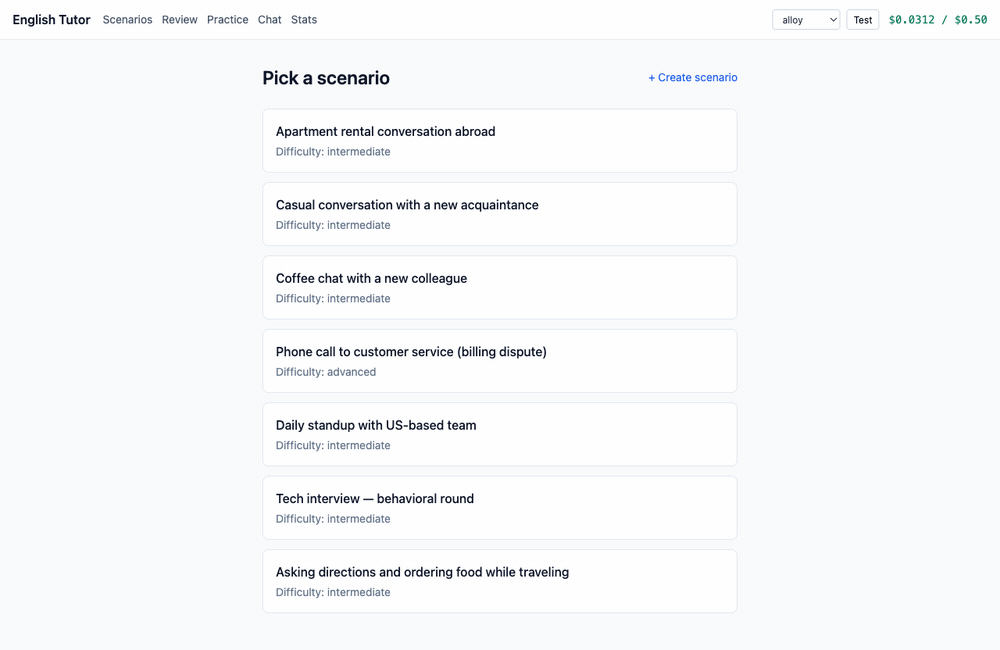
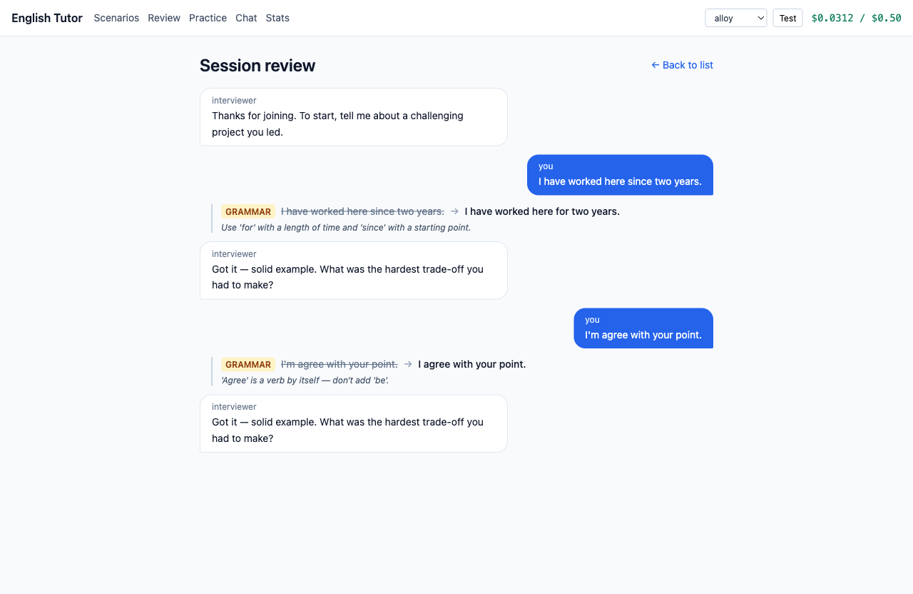
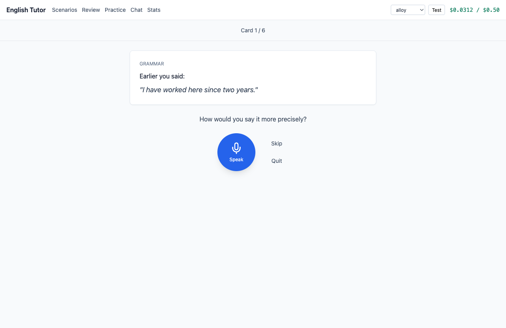
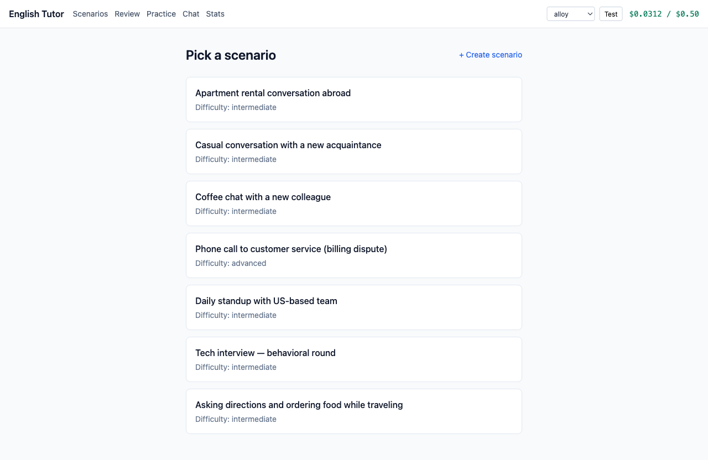
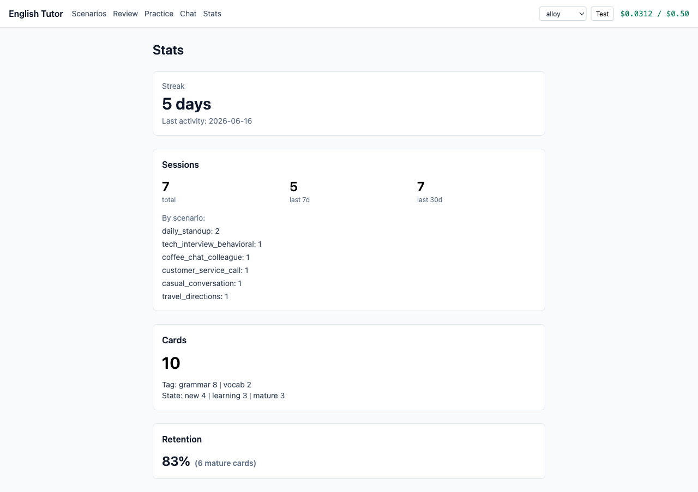

<h1 align="center">English Tutor</h1>

<p align="center">
  <b>Voice-first English speaking practice through LLM roleplay.</b><br>
  Talk through real-life scenarios, get your grammar and vocabulary corrected on the spot,
  and re-practice your mistakes with spaced repetition — from the terminal or a local web UI.
</p>

<p align="center">
  
</p>

## Highlights

- 🎙️ **Voice-first roleplay** — pick a scenario (tech interview, daily standup, customer-service call, renting a flat abroad…), speak your turns, and the model plays the counterpart.
- ✍️ **Inline corrections** — every turn is checked for grammar and vocabulary slips, each with a short, plain explanation.
- 🔁 **Spaced repetition** — your mistakes become flashcards (SM-2) you re-attempt **by voice**, so corrections actually stick.
- 📊 **Progress tracking** — streak, sessions over time, card states (new / learning / mature) and retention rate.
- 💸 **Budget guard** — hard daily USD and token caps so a practice habit stays cheap.
- 🖥️ **Two front-ends, one backend** — a terminal CLI and a local web UI that share the same engine and data.

## How it works

1. Choose a scenario. The model opens the conversation in character.
2. You reply by voice; speech is transcribed locally with Whisper.
3. The model responds in character **and** returns corrections for what you said.
4. When you end the session, your most useful corrections are turned into review cards.
5. Later, review surfaces due cards and asks you to say the corrected version out loud.

## Screens

<table>
  <tr>
    <td width="50%"></td>
    <td width="50%"></td>
  </tr>
  <tr>
    <td align="center"><em>Session review — roleplay transcript with inline grammar/vocab fixes</em></td>
    <td align="center"><em>Spaced-repetition review — say the corrected version out loud</em></td>
  </tr>
  <tr>
    <td width="50%"></td>
    <td width="50%"></td>
  </tr>
  <tr>
    <td align="center"><em>Pick a scenario (built-in or your own)</em></td>
    <td align="center"><em>Progress: streak, sessions, cards, retention</em></td>
  </tr>
</table>

## Setup

```bash
cp .env.example .env          # then fill in your OpenRouter API key
python -m venv .venv && source .venv/bin/activate
pip install -e ".[dev]"
pytest                        # all tests should pass
```

## CLI

```bash
tutor interview        # start a practice session
tutor review           # review due spaced-repetition cards
tutor stats            # streak, sessions, cards, retention
tutor list-scenarios   # list available scenarios
```

During a session, press **Enter** to start/stop recording each turn. Type `end` instead of speaking to finish.

## Web UI

```bash
./scripts/build_and_serve.sh
# then open http://127.0.0.1:8000
```

This installs the frontend deps, builds the React app into `tutor/web/static/`, and starts FastAPI, which serves both the API (`/api/*`) and the built frontend.

**Frontend dev workflow:**

```bash
# terminal 1 — API with reload
uvicorn tutor.web.api:create_app --factory --reload --host 127.0.0.1 --port 8000
# terminal 2 — Vite dev server (proxies /api to :8000)
cd frontend && npm run dev
```

## Configuration

Settings live in `.env` (gitignored — never commit it). See `.env.example` for the full list; the essentials:

| Variable | Purpose | Default |
|---|---|---|
| `OPENROUTER_API_KEY` | OpenRouter API key (required) | — |
| `OPENROUTER_MODEL` | Conversational model | `google/gemini-2.5-flash` |
| `DAILY_USD_BUDGET` | Hard daily spend cap (USD) | `0.5` |
| `DAILY_TOKEN_BUDGET` | Hard daily token cap | `200000` |
| `WHISPER_MODEL_SIZE` | faster-whisper model size | `small` |

## Tech

- **Backend** — Python 3.11+, FastAPI, OpenAI SDK (via OpenRouter), `faster-whisper` for local ASR, macOS `say` / OpenRouter TTS for speech.
- **Frontend** — React 18 + TypeScript + Vite + Tailwind.
- **Storage** — local JSON files (one per session) plus a cards file; single-user, no database.

## Tests

```bash
pytest                        # backend
cd frontend && npm test       # frontend (vitest)
ruff check .                  # lint
```
